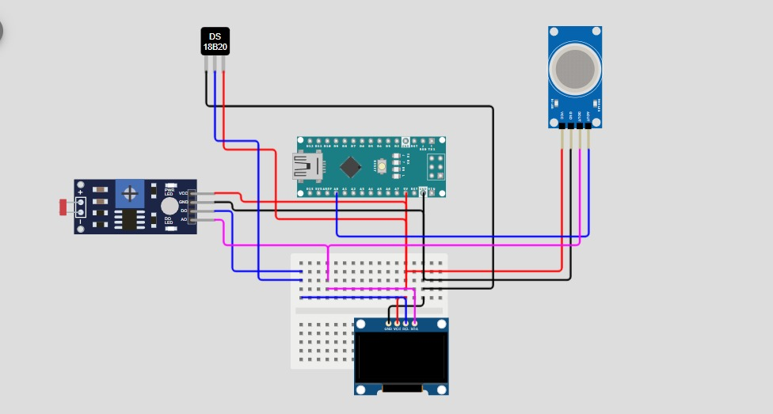

# Estación Meteorológica Arduino-Python



## Descripción

Este proyecto implementa una estación meteorológica básica que mide parámetros ambientales mediante sensores conectados a un Arduino y muestra los datos en una pantalla OLED integrada.

Mediante comunicación serial a través del puerto "COM", una interfaz gráfica desarrollada en Python recibe y visualiza los datos en tiempo real de forma gráfica. La interfaz también permite guardar un registro de las últimas 50 muestras almacenadas en un **deque** en un archivo CSV para su análisis posterior.

---

## Sensores utilizados

- **BH1750**: Sensor digital de luz ambiental (lux).
- **MQ135**: Sensor analógico para detectar calidad del aire.
- **BMP180**: Sensor digital de presión barométrica y temperatura.
- **DHT11**: Sensor de temperatura y humedad relativa (opcional según código).

---

## Funcionamiento

### Arduino

El código en Arduino se encarga de:

- Leer continuamente los valores de los sensores BH1750, MQ135, BMP180 y DHT11.
- Mostrar las lecturas en una pantalla OLED de 128x64 píxeles, actualizando los valores en tiempo real.
- Enviar los datos leídos por el puerto serial en un formato legible para que la interfaz Python pueda capturarlos y graficarlos.

### Interfaz en Python

El programa en Python realiza las siguientes tareas:

- Se conecta al puerto serial configurado (por ejemplo, "COM10") para recibir los datos enviados por el Arduino.
- Utiliza una estructura de datos **deque** para almacenar las últimas 50 muestras de cada variable medida.
- Visualiza los datos recibidos en gráficos actualizados en tiempo real usando `matplotlib`.
- Incluye un botón que, al presionarlo, guarda el contenido del deque en un archivo CSV, facilitando el análisis y almacenamiento de datos históricos.

---

## Requisitos

### Librerías para Arduino

Para que el código funcione correctamente, debes instalar las siguientes librerías en el Arduino IDE:

- `BH1750` (para el sensor de luz ambiental)
- `Adafruit_BMP085` o `Adafruit_BMP180` (para el sensor de presión y temperatura)
- `Adafruit_SSD1306` (para la pantalla OLED)
- `DHT` (para el sensor de temperatura y humedad DHT11, si se usa)
- `Wire` (comunicación I2C, suele venir incluida con el IDE)

Puedes instalarlas desde el **Gestor de Librerías** del Arduino IDE.

### Librerías para Python

Para la interfaz gráfica en Python, instala las siguientes librerías:

```bash
pip install pyserial matplotlib
